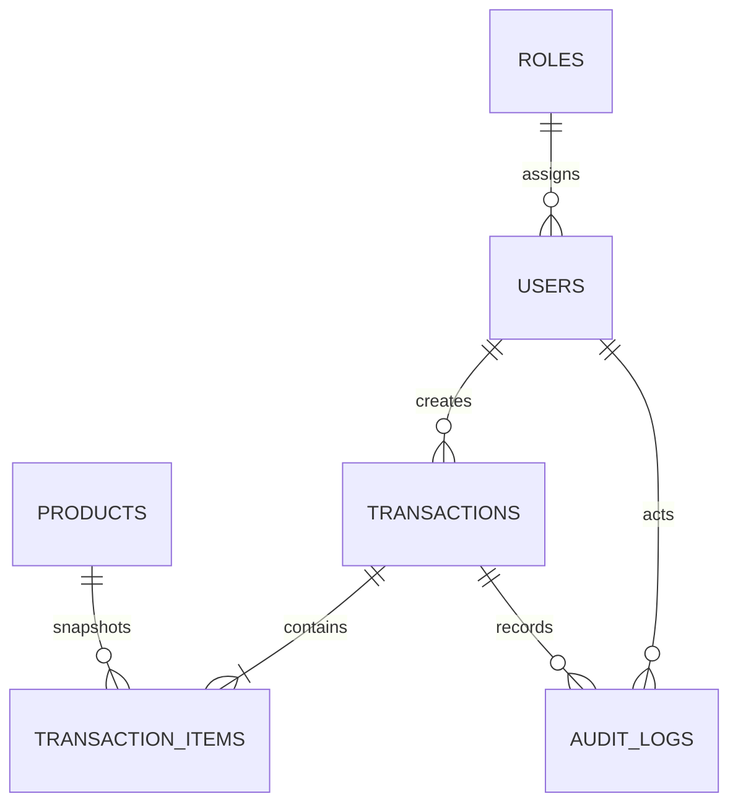

<!--
@file 04-Data-Model.md
@version 1.1.1
@description Model data minimum dan relasi utama MVP Parissa POS.
-->

# 04 — Data Model

**Status:** Gate A disetujui 22 Juli 2026.

**Fase aktif:** Phase 2 — Engineering Foundation; schema siap dirancang untuk Gate C.

## ERD Ringkas

## 1. `roles`

| Field | Type | Rule |
|-------|------|------|
| id | uuid PK | `gen_random_uuid()` |
| code | text unique | `owner`, `cashier` |
| name | text | Owner, Kasir |
| permissions | jsonb | Seeded; no MVP editor |

## 2. `users`

| Field | Type | Rule |
|-------|------|------|
| id | uuid PK/FK | Supabase Auth user id |
| name | text | Required |
| role_id | uuid FK | Required |
| is_active | boolean | Default true |
| created_at | timestamptz | Required |
| updated_at | timestamptz | Required |

## 3. `products`

| Field | Type | Rule |
|-------|------|------|
| id | uuid PK | Generated |
| name | text | Required |
| category | text | Dessert/Minuman/Bundling |
| selling_price | numeric(14,2) | ≥0 |
| standard_cost | numeric(14,2) | ≥0 |
| image_url | text nullable | Optional |
| is_active | boolean | Soft deactivate |
| created_at/updated_at | timestamptz | Required |

## 4. `transactions`

| Field | Type | Rule |
|-------|------|------|
| id | uuid PK | Generated |
| transaction_number | text unique | Human-readable |
| business_date | date | Default Asia/Jakarta today |
| customer_name | text nullable | Required when unpaid |
| customer_phone | text nullable | Optional |
| payment_status | text | `Sudah`/`Belum` |
| total_amount | numeric(14,2) | Server-calculated |
| total_cost | numeric(14,2) | Server-calculated |
| notes | text nullable | Optional |
| idempotency_key | uuid unique | Prevent duplicate submit |
| is_void | boolean | Default false |
| void_reason | text nullable | Required when void |
| voided_at/voided_by | nullable | Audit void |
| paid_at/paid_by | nullable | Wajib saat `Sudah`; kosong saat `Belum` |
| created_by/created_at | required | Actor and timestamp |

## 5. `transaction_items`

| Field | Type | Rule |
|-------|------|------|
| id | uuid PK | Generated |
| transaction_id | uuid FK | Cascade-restricted by policy |
| product_id | uuid FK | Reference source product |
| product_name_snapshot | text | Required |
| unit_price_snapshot | numeric(14,2) | Required |
| unit_cost_snapshot | numeric(14,2) | Required |
| quantity | integer | >0 |
| subtotal | numeric(14,2) | Server-calculated |
| cost_total | numeric(14,2) | Server-calculated |

## 6. `audit_logs`

| Field | Type | Rule |
|-------|------|------|
| id | uuid PK | Generated |
| entity_type | text | `transaction` |
| entity_id | uuid | Transaction id |
| action | text | `create`, `mark_paid`, `mark_unpaid`, `void` |
| old_values/new_values | jsonb | Minimum relevant diff |
| actor_id | uuid FK | Required |
| created_at | timestamptz | Required |

## Database Rules

- Seluruh mutation memakai RLS dan transaction-safe RPC.
- Total tidak dipercaya dari client; database menghitung dari snapshot items.
- Tidak ada `DELETE` policy untuk transactions dan items.
- Migration lama tidak dipakai ulang tanpa mapping review.
- Mutation create transaksi `Sudah` mengisi `paid_at`/`paid_by`; mark-as-paid mengisi keduanya pada waktu pembayaran.
- Owner-only mark-as-unpaid membersihkan `paid_at`/`paid_by` dan menulis audit log dalam satu transaksi database.
- Aggregate omzet, HPP, dan gross profit memakai tanggal `paid_at` dalam `Asia/Jakarta`; piutang memakai transaksi aktif berstatus `Belum`.
- Schema P0 tidak memuat data historis. Migrasi historis memakai proses staging dan mapping idempotent terpisah setelah rekonsiliasi.
