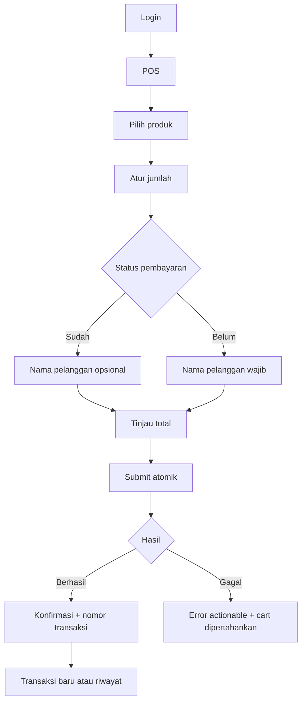

<!--
@file 05-POS-Flow.md
@version 1.1.0
@description Alur pengguna dan state utama POS MVP Parissa.
-->

# 05 — POS Flow

**Status:** Gate A disetujui 22 Juli 2026.

**Fase aktif:** Phase 1 — UX Prototype.

## Happy Path

Transaksi `Sudah` mengisi `paid_at` pada saat submit berhasil. Transaksi `Belum` masuk piutang tanpa pengakuan omzet/HPP/gross profit sampai dilunasi.

## State POS

1. **Loading:** skeleton grid dan cart disabled.
2. **Ready/Empty cart:** produk aktif terlihat, CTA submit disabled.
3. **Cart active:** total real-time, quantity controls tersedia.
4. **Validation error:** field bermasalah diberi pesan Bahasa Indonesia.
5. **Submitting:** CTA disabled dan spinner; idempotency key aktif.
6. **Success:** confirmation receipt ringkas.
7. **Server error:** cart tidak hilang dan tersedia retry.
8. **No products:** empty state meminta Owner mengaktifkan produk.

## Target Interaksi

Transaksi umum satu produk:

1. Tap produk.
2. Pilih status pembayaran.
3. Tap simpan.

Target maksimal tiga aksi utama jika nama pelanggan tidak diperlukan.

## Failure Scenarios

- Produk dinonaktifkan setelah masuk cart.
- Harga berubah sebelum submit.
- Koneksi putus saat submit.
- Pengguna tap submit dua kali.
- Session expired.
- RPC berhasil tetapi response client terputus.

Setiap skenario harus memiliki expected behavior dalam E2E/integration test.
