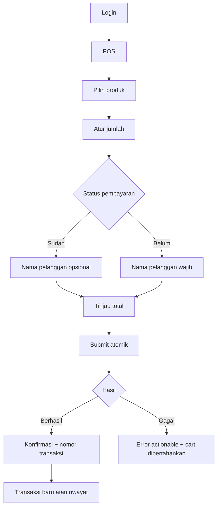

<!--
@file 05-POS-Flow.md
@version 1.2.4
@description Alur pengguna dan state utama POS MVP Parissa.
-->

# 05 — POS Flow

**Status:** Gate A disetujui 22 Juli 2026.

**Fase aktif:** Phase 3 — Core POS; flow dikunci oleh Gate B dan fondasi implementasi disetujui melalui Gate C.

## Happy Path

Transaksi `Sudah` mengisi `paid_at` pada saat submit berhasil. Transaksi `Belum` masuk piutang tanpa pengakuan omzet/HPP/gross profit sampai dilunasi.

## State POS

1. **Loading:** skeleton grid dan cart disabled.
2. **Ready/Empty cart:** produk aktif terlihat; checkout, status pembayaran, customer field, total, dan submit belum ditampilkan.
3. **Cart active:** quantity stepper dan input langsung, total, serta pilihan `Sudah`/`Belum` tersedia tanpa default.
4. **Validation error:** field bermasalah diberi pesan Bahasa Indonesia.
5. **Submitting:** CTA disabled dan spinner; idempotency key aktif.
6. **Success:** confirmation receipt ringkas.
7. **Server error:** cart tidak hilang dan tersedia retry.
8. **No products:** empty state meminta Owner mengaktifkan produk.

## Target Interaksi

Transaksi umum satu produk:

1. Tap produk.
2. Pilih status pembayaran.
3. Tap simpan.

Target desktop maksimal tiga aksi utama jika nama pelanggan tidak diperlukan. Pada mobile ada satu aksi tambahan untuk membuka cart bottom sheet sebelum memilih pembayaran.

Status pembayaran selalu merupakan keputusan eksplisit Kasir. Sistem tidak boleh menganggap transaksi lunas hanya karena halaman baru dibuka atau cart baru dibuat.

Input quantity hanya menerima integer positif mulai dari 1. Nilai nol, minus, desimal, huruf, dan simbol ditolak tanpa mengubah nilai cart terakhir yang valid.

## Validasi Waktu Phase 1

Pengujian manual Owner pada 23 Juli 2026 menghasilkan durasi 4, 8, 9, 7, dan 3 detik.

- Median: 7 detik.
- Rata-rata: 6,2 detik.
- Rentang: 3–9 detik.
- Hasil: lima dari lima percobaan berada di bawah target 30 detik.

Kriteria waktu Gate B dinyatakan lulus. Owner menyetujui Gate B pada 23 Juli 2026 dan Phase 2 boleh dimulai.

## Failure Scenarios

- Produk dinonaktifkan setelah masuk cart.
- Harga berubah sebelum submit.
- Koneksi putus saat submit.
- Pengguna tap submit dua kali.
- Session expired.
- RPC berhasil tetapi response client terputus.

Setiap skenario harus memiliki expected behavior dalam E2E/integration test.
